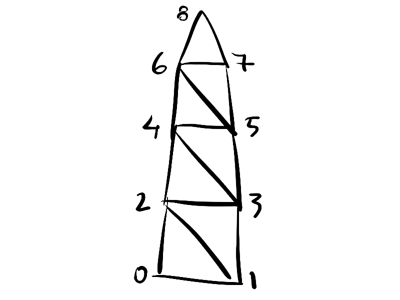

# Procedural Grass with Compute Shaders

Written in HLSL for **Unity 2021.3.10f1**

## Screenshots

<!-- thumb.mp4 -->

https://user-images.githubusercontent.com/4588601/199116273-03083ae9-0bd7-40e1-b37c-39d504057b3e.mp4

### References

- [Compute Shaders course by Nik Lever](https://www.udemy.com/course/compute-shaders)
- [Low-Poly Simple Nature Pack](https://assetstore.unity.com/packages/3d/environments/landscapes/low-poly-simple-nature-pack-162153)
- [Spatial Transformation Matrices](https://www.brainvoyager.com/bv/doc/UsersGuide/CoordsAndTransforms/SpatialTransformationMatrices.html)
- [Matrix multiplication](https://en.wikipedia.org/wiki/Matrix_multiplication)
- [Shadow Caster and Receive Shadow Shaders](https://docs.unity3d.com/Manual/SL-VertexFragmentShaderExamples.html)

## Sections

- [Implementation](#implementation)
  - [C# Code](#c#-code)
    - [Procedural Mesh](#procedural)
    - [Initialize Grass Blades Array](#initialize-grass-blades-array)
    - [Initialize Compute Buffers](#initialize-compute-buffers)
    - [Initialize IndirectArguments ComputeBuffer](#initialize-indirectarguments-computebuffer)
    - [Dispatch Compute Shader](#dispatch-compute-shader)
    - [Draw Mesh Instanced Indirect](#draw-mesh-instanced-indirect)
  - [Compute Shader](#compute-shader)
  - [Vertex Fragment Shader](#vertex-fragment-shader)
    - [Position Vertices in Clip Space](#position-vertices-in-clip-space)
    - [Apply Wind](#apply-wind)
    - [Shadows](#shadows)

## Implementation

### C# Code

#### Procedural Mesh

- Create a **Mesh** procedurally, to render the grass blades.



```cs
public static Mesh GetGrassBladeMesh()
{
    var mesh = new Mesh();

    // define the vertices
    mesh.vertices = new Vector3[] {
        ...
    };

    // define the normals
    Vector3[] normalsArray = new Vector3[mesh.vertices.Length];
    System.Array.Fill(normalsArray, new Vector3(0, 0, -1));
    mesh.normals = normalsArray;

    mesh.uv = new Vector2[] {
        ...
    };

    mesh.SetIndices(
        // counter clock wise so the normals make sense
        indices: new int[]{
            ...
        },
        topology: MeshTopology.Triangles,
        submesh: 0
    );

    return mesh;
}
```

#### Initialize Grass Blades Array

- Given the **Bounds** and the **Density**, create randomly located grass blades.
- Using **Raycast**, position the grass on top of the terrain.

```cs
for (var i = 0; i < grassBlades.Length; i++)
{
    var grassBlade = grassBlades[i];

    var localPos = new Vector3(
        x: Random.Range(-bounds.extents.x, bounds.extents.x),
        y: 0,
        z: Random.Range(-bounds.extents.z, bounds.extents.z)
    );

    RaycastHit hit;
    var didHit = Physics.Raycast(
        origin: transform.TransformPoint(localPos) + (transform.up * 20),
        direction: -transform.up,
        hitInfo: out hit
    );

    if (didHit)
    {
        localPos.y = hit.point.y;
    }

    grassBlade.position = transform.TransformPoint(localPos);

    grassBlade.rotationY = Random.Range((float)-System.Math.PI, (float)System.Math.PI);

    grassBlades[i] = grassBlade;
}
```

#### Initialize Compute Buffers

- Set the buffer to both the **Compute Shader** and the **Material**, so the **Vertex/Fragment Shader** can access the data using the `SV_InstanceID` from the **GPU Instancing**.

```cs
private void InitializeGrassBladesBuffer()
{
    var grassBladeMemorySize = (3 + 1 + 1 + 1) * sizeof(float);

    _grassBladesBuffer = new ComputeBuffer(
        count: _grassBlades.Length,
        stride: _grassBlades.Length * grassBladeMemorySize
    );

    _grassBladesBuffer.SetData(_grassBlades);

    _kernelIndex = ComputeShader.FindKernel("SimulateGrass");

    // this will let compute shader access the buffers
    ComputeShader.SetBuffer(_kernelIndex, "GrassBladesBuffer", _grassBladesBuffer);

    // this will let the surface shader access the buffer
    Material.SetBuffer("GrassBladesBuffer", _grassBladesBuffer);
}
```

#### Initialize IndirectArguments ComputeBuffer

- The buffer with the arguments for **DrawMeshInstancedIndirect** will indicate how many meshes instances we need to draw.

```cs
// for Graphics.DrawMeshInstancedIndirect
// this will be used by the vertex/fragment shader
// to get the instance_id and vertex_id
var args = new int[_argsCount] {
    (int)_mesh.GetIndexCount(submesh: 0),       // indices of the mesh
    _grassBladesCount,                          // number of objects to render
    0,0,0                                       // unused args
};
```

#### Dispatch Compute Shader

- The **Compute Shader** needs several variable set before it can compute the wind and age colors for the grasses.
- The thread groups count will be the amount of individual grasses we need to render.

```cs
ComputeShader.SetFloat("Time", Time.time);
ComputeShader.SetInt("AgeNoiseColumns", AgeNoiseColumns);
ComputeShader.SetInt("AgeNoiseRows", AgeNoiseRows);
ComputeShader.SetInt("WindNoiseColumns", WindNoiseColumns);
ComputeShader.SetInt("WindNoiseRows", WindNoiseRows);
ComputeShader.SetFloat("WindVelocity", WindVelocity);

ComputeShader.Dispatch(_kernelIndex, (int)_threadGroupsCountX, 1, 1);

Material.SetVector("WindDirection", WindDirection);
Material.SetFloat("WindForce", WindForce);
Material.SetColor("YoungGrassColor", YoungGrassColor);
Material.SetColor("OldGrassColor", OldGrassColor);
```

#### Draw Mesh Instanced Indirect

- This will be in charge of drawing all the grasses.

```cs
Graphics.DrawMeshInstancedIndirect(
    mesh: _mesh,
    submeshIndex: 0,
    material: Material,
    bounds: _bounds,
    bufferWithArgs: _argsBuffer
);
```

### Compute Shader

- A simple program that computes the wind and color noises using the **Perlin Noise** algorithm.
- The position of the grass relative to the parent terrain will determine the quadrant and coordinates used to calculate the noise.
- The **Time** is used to animate the wind noise.

```c
RWStructuredBuffer<GrassBlade> GrassBladesBuffer;
float Time;
int AgeNoiseColumns;
int AgeNoiseRows;
float WindVelocity;
int WindNoiseColumns;
int WindNoiseRows;
float3 GrassOrigin;
float3 GrassSize;

[numthreads(1,1,1)]
void SimulateGrass (uint3 id : SV_DispatchThreadID)
{
    GrassBlade grassBlade = GrassBladesBuffer[id.x];

    float3 grassLocalPosition = grassBlade.position - GrassOrigin;
    float2 uv = float2(
        (grassLocalPosition.x + (GrassSize.x / 2)) / GrassSize.x,
        (grassLocalPosition.z + (GrassSize.z / 2)) / GrassSize.z
    );

    grassBlade.ageNoise = (perlin(uv, AgeNoiseColumns, AgeNoiseRows, 1) + 1) / 2;
    grassBlade.windNoise = perlin(uv, WindNoiseColumns, WindNoiseRows, Time * WindVelocity);

    GrassBladesBuffer[id.x] = grassBlade;
}
```

### Vertex Fragment Shader

#### Position Vertices in Clip Space

- First get a **Translation Matrix** to move the vertices in **world space**, to the desired position.
- Then get a **Rotation Matrix** to apply the random rotaion along the Y axis, to give a more natural look.
- Multiply these matrices together to create a **Transformation Matrix**.
- Use **unity_ObjectToWorld** to obtain the world space position of the vertex, then transform it using the transformation matrix.

```c
float4 positionVertexInWorld(GrassBlade grassBlade, float4 positionOS) {
    // generate a translation matrix to move the vertex
    float4x4 translationMatrix = getTranslation_Matrix(grassBlade.position);
    float4x4 rotationMatrix = getRotationY_Matrix(grassBlade.rotationY);
    float4x4 transformationMatrix = mul(translationMatrix, rotationMatrix);

    // translate the object pos to world pos
    float4 worldPosition = mul(unity_ObjectToWorld, positionOS);
    // then use the matrix to translate and rotate it
    worldPosition = mul(transformationMatrix, worldPosition);

    return worldPosition;
}
```

#### Apply Wind

- Move the vertices along the **wind direction** vector.
- Multiply by the **wind noise** that was computed by the compute shader.
- Multiply by the **wind force**, to have control over the animation.
- Lerp between the displaced vertex and the original vertex, using the Y UV coordinate, so that the base of the grass is stationary, and the top moves.

```c
float4 applyWind(GrassBlade grassBlade, float2 uv, float4 worldPosition, float3 windDirection, float windForce) {
    float3 displaced = worldPosition.xyz + (normalize(windDirection) * windForce * grassBlade.windNoise);
    float4 displacedByWind = float4(displaced, 1);

    // base of the grass needs to be static on the floor
    return lerp(worldPosition, displacedByWind, uv.y);
}
```

#### Shadows

```c
Pass
{
    Tags {"LightMode"="ForwardBase"}

    Cull Off

    CGPROGRAM
    #pragma vertex vert
    #pragma fragment frag
    #pragma multi_compile_instancing
    #pragma multi_compile_fwdbase

    struct Varyings
    {
        ...
        SHADOW_COORDS(1) // put shadows data into TEXCOORD1
    };

    Varyings vert (Attributes IN, uint vertex_id: SV_VERTEXID, uint instance_id: SV_INSTANCEID)
    {
        ...
        TRANSFER_SHADOW(OUT)
        ...
    }

    half4 frag (Varyings IN) : SV_Target
    {
        fixed shadow = SHADOW_ATTENUATION(IN);
        ...
    }
    ENDCG
}

Pass
{
    Tags {"LightMode"="ShadowCaster"}

    Cull Off

    CGPROGRAM
    #pragma vertex vert
    #pragma fragment frag
    #pragma multi_compile_instancing
    #pragma multi_compile_shadowcaster

    ...

    ENDCG
}
```

## Progress

<!-- 1.mp4 -->

https://user-images.githubusercontent.com/4588601/199115765-3ed9851b-ad1a-4356-bc83-a04cdc52e5ab.mp4

<!-- 2.mp4 -->

https://user-images.githubusercontent.com/4588601/199115844-1da029e4-5860-4718-b558-2cf188731d41.mp4

<!-- 3.mp4 -->

https://user-images.githubusercontent.com/4588601/199115869-fe891a21-8bfc-4bb5-8f48-6e36633f4e67.mp4

<!-- 4.mp4 -->

https://user-images.githubusercontent.com/4588601/199115895-0d8b0d99-6103-48ad-8299-444dbcbbff80.mp4

<!-- 5.mp4 -->

https://user-images.githubusercontent.com/4588601/199115917-cb7eaf41-49e2-4b35-8b9d-6b7d7d85fee5.mp4

<!-- 6.mp4 -->

https://user-images.githubusercontent.com/4588601/199115939-9f168a1c-de0d-4388-a80b-18b467232a9a.mp4

<!-- 7a.mp4 -->

https://user-images.githubusercontent.com/4588601/199115965-08652815-7cbf-4570-b522-a75dcca34782.mp4

<!-- 7b.mp4 -->

https://user-images.githubusercontent.com/4588601/199115991-e2be1227-ce12-4793-9123-2f2bf3dd770a.mp4

<!-- 8.mp4 -->

https://user-images.githubusercontent.com/4588601/199116042-06d79015-260f-46e2-9a29-79670c970cbc.mp4

<!-- 9.mp4 -->

https://user-images.githubusercontent.com/4588601/199116061-4d52d2ef-0028-469a-a40b-c00d320ac85d.mp4

<!-- 10.mp4 -->

https://user-images.githubusercontent.com/4588601/199116091-baa903b2-e015-47d7-bf56-c8538994ad16.mp4

<!-- 11.mp4 -->

https://user-images.githubusercontent.com/4588601/199116119-7ef3df0b-cff6-4655-8e6b-6d491e2fdce4.mp4

<!-- 12a.mp4 -->

https://user-images.githubusercontent.com/4588601/199116149-f8440631-7091-486a-be38-4f49483f875f.mp4

<!-- 12b.mp4 -->

https://user-images.githubusercontent.com/4588601/199116184-53d7d4a4-a51c-408e-b40f-babfd39cb658.mp4
